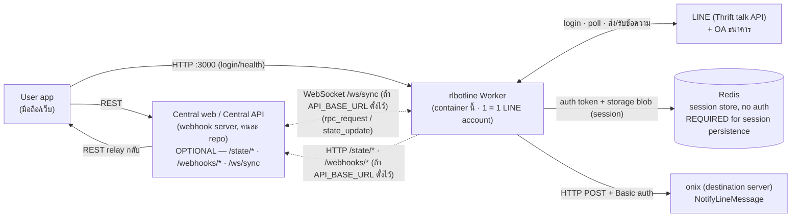
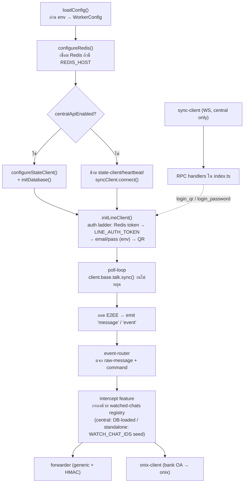

# Architecture — rlbotline Worker

## 1. เป้าหมายของระบบ

ระบบนี้ให้ **LINE user account (selfbot)** ทำ 2 อย่างหลัก:

1. **ติดตาม LINE OA ธนาคาร** (`@scbconnect`, `@krungthaiconnext`, `@kbanklive`) แล้ว **forward
   ข้อความแจ้งเตือน (เช่น เงินเข้า) ไปยัง onix** ("destination server") ผ่าน endpoint `NotifyLineMessage`
2. เปิดให้ **user app ล็อกอิน LINE** ได้ทั้งแบบ **QR** และ **email/password** โดยยิงผ่าน **central web
   (webhook server)** → central web สั่ง bot container ไปคุยกับ LINE → bot รายงานสถานะ (QR/PIN/ready)
   กลับให้ผู้ร้องขอ

Worker นี้เป็นแค่ **หนึ่งชิ้นส่วน** — 1 worker container = 1 LINE account. **LINE session** (auth token +
linejs storage blob พร้อม E2EE keys) persist ไปที่ **Redis** (`REDIS_HOST`, ไม่มี auth) เท่านั้น — worker
ไม่เก็บ state อะไรลง disk ท้องถิ่น ส่วน **Central API เป็นออปชัน** (`API_BASE_URL`): เมื่อตั้งไว้ worker จะเก็บ/อ่าน
state อื่น (admin, blacklist, dynamic watched chats, auto-reply, ฯลฯ) ผ่าน `/state/*`; เมื่อ **ไม่ตั้ง**
worker รันแบบ **standalone เต็มรูปแบบ** — ทุกฟีเจอร์ที่ต้องพึ่ง state จาก Central API (admin/permission/
blacklist/toggle) จะ **default-deny/ปิด** (อ่านคืนค่าว่าง `[]`/`null`/`false`, เขียนเป็น no-op) เหลือแค่เส้นทาง
forward เงียบๆ (`WATCH_CHAT_IDS` → `WEBHOOK_URL`, และ bank OA → onix) ที่ยังทำงานได้ครบ

> โค้ด/รายละเอียดเฉพาะเรื่อง forwarding อยู่ใน [forwarding.md](./forwarding.md) และเรื่อง login อยู่ใน
> [login.md](./login.md)

## 2. Component overview

**หลักการสำคัญ:** worker คุยกับ LINE / onix / Redis / central web แบบ **outbound** เป็นหลัก (dial out ทั้ง
REST และ WebSocket) — แต่ในโหมด **standalone app** จะเปิด **inbound HTTP API บน `HTTP_PORT` (default 3000)**
เพิ่มด้วย ([../src/core/http-server.ts](../src/core/http-server.ts)) ให้ยิง login/health มาที่ bot ตรงๆ ได้
ไม่ต้องมี central web มาคุม ส่วนคำสั่งจาก central web (ถ้ามี) ยังมาทาง **WebSocket RPC** บน socket ที่ worker
เปิดค้างไว้เหมือนเดิม — เส้นประ (`-.->`) ในไดอะแกรมข้างบนคือช่องทางที่มีเฉพาะเมื่อ `API_BASE_URL` ถูกตั้ง
(`config.centralApiEnabled`); เส้นทึบไป Redis คือช่องทางเดียวที่ worker "เก็บ state" จริง (แม้จะเป็น
external service ก็ตาม)

## 3. ช่องทางสื่อสารระหว่าง worker กับ central web

> **ทุกแถวในตารางนี้ทำงานเฉพาะเมื่อ `API_BASE_URL` ถูกตั้ง** (`config.centralApiEnabled === true`,
> [../src/core/config.ts](../src/core/config.ts)) ถ้าไม่ตั้ง `configureStateClient`/`initDatabase`/
> `startHeartbeat`/`syncClient.connect()` และ initial chat-discovery push จะถูก **ข้ามทั้งหมด** ตอน boot
> ([../src/index.ts](../src/index.ts) — เช็คตัวแปร `central`) `state-client.ts`'s `stateRequest()` จะ throw
> `CentralApiDisabledError` ถ้าถูกเรียกตอนไม่ได้ configure แต่ทุก caller ใน `database.ts` เช็ค
> `isCentralApiEnabled()` ก่อนเสมอ ไม่ปล่อยให้ throw หลุดออกไป (คืนค่า default แทน — ดู §1)
>
> `/state/session/*` (session persistence ผ่าน Central API) **ถูกลบออกจากโค้ดแล้ว** — session ทั้งหมดย้ายไป
> Redis (ดู [login.md](./login.md) §9)

| ช่องทาง | ทิศทาง | ใช้ทำอะไร | ไฟล์ |
|---|---|---|---|
| `GET/POST/PUT /state/*` | worker → central | อ่าน/เขียน state (watched chats, admin, blacklist, auto-reply, ...) ด้วย Bearer `INSTANCE_TOKEN` — **ไม่มี session อีกต่อไป** (ย้ายไป Redis) | [../src/core/state-client.ts](../src/core/state-client.ts), [../src/core/database.ts](../src/core/database.ts) |
| `POST /webhooks/worker` | worker → central | รายงานสถานะ: `pincode`, `qrcode`, `ready`, `error`, `status`, `heartbeat`, `shutdown` | [../src/core/webhook.ts](../src/core/webhook.ts) |
| `POST /webhooks/forward` | worker → central | sink กลางสำหรับข้อความจาก watched chats (payload แบบ generic) — default ของ `WEBHOOK_URL` เมื่อ `API_BASE_URL` ตั้งไว้เท่านั้น | [../src/core/forwarder.ts](../src/core/forwarder.ts) |
| `WebSocket /ws/sync` | worker ↔ central | รับ `rpc_request` (central สั่ง worker), `state_update` (invalidate cache); ตอบ `rpc_response` | [../src/core/sync-client.ts](../src/core/sync-client.ts) |

**RPC ที่ central web เรียกได้** (ลงทะเบียนใน [../src/index.ts](../src/index.ts)):
`discover_chats`, `reload_watched_chats`, `list_group_members`, `lookup_contact`, `kick_member`,
`invite_members`, `add_friend`, `list_friends`, `sweep_blacklist`, `backup_group`, `recover_group`,
`list_commands`, `execute_command`, และที่เพิ่มใหม่: **`login_qr`**, **`login_password`**, **`ensure_bank_oa`**
— ทั้งหมดถูก `syncClient.onRpc(...)` ลงทะเบียนไว้เสมอ (unconditional, เป็นแค่ Map insert ในหน่วยความจำ) แต่จะ
**ไม่มีทางถูกเรียกจริง** ถ้า `syncClient.connect()` ไม่รัน (คือถ้า `centralApiEnabled === false`)

### Inbound HTTP API (standalone, บน `HTTP_PORT`)

นอกจากช่องทาง outbound ข้างบน worker ยังเปิด HTTP server ขาเข้าบน `HTTP_PORT` (default 3000) —
[../src/core/http-server.ts](../src/core/http-server.ts):

| Method + Path | Auth | ใช้ทำอะไร |
|---|---|---|
| `GET /health` | ไม่ต้อง | liveness + login state |
| `GET /login/status` | Basic | สถานะ login เต็ม (qrUrl / pincode / profile) |
| `POST /login/qr` | Basic | เริ่ม QR login |
| `POST /login/password` | Basic | เริ่ม email/password login |

รายละเอียดใน [login.md](./login.md) — ปิดได้ด้วย `HTTP_PORT=0`

## 4. Runtime model ภายใน worker

- **ไม่ใช้** `client.listen()` (LEGY HTTP/2 push พังบน Bun) — ใช้ **short/long-poll** บน `talk.sync()` แทน
  ([../src/core/poll-loop.ts](../src/core/poll-loop.ts))
- ทุก outbound LINE call ผ่าน **shared rate limiter** (proxy บน `client.base.talk`) เพื่อกันแบน; `sync` ถูกยกเว้น
- E2EE (Letter Sealing) ต้องถอดก่อนอ่านข้อความ — การ login ใหม่ (ไม่ใช่ token restore จาก Redis) จะหมุนกุญแจ
  E2EE (มี warning ใน log/dashboard)
- `configureRedis()` รันก่อน auth เสมอ ไม่ว่า central จะเปิดหรือปิด — Redis คือ session store เดียว
  (ดู [login.md](./login.md) §9); ถ้า `REDIS_HOST` ไม่ตั้ง จะ log warning ดังๆ แล้ว fallback เป็น in-memory
  session (หายทุก restart)

## 5. Data flow

### 5.1 Bank OA → onix (message forwarding)

ดูรายละเอียดใน [forwarding.md](./forwarding.md) — สรุป: `talk.sync()` → ถอด E2EE → event-router →
`intercept` เช็คว่าเป็น watched chat ที่ enabled → ถ้าเป็น OA และ onix เปิดใช้ → `onix-client.notifyLineMessage()`
POST ไป onix ด้วย Basic auth

### 5.2 On-demand login

ดูรายละเอียดใน [login.md](./login.md) — สรุป: user app → central web → RPC `login_qr`/`login_password` →
worker เริ่ม login กับ LINE → รายงาน `qrcode`/`pincode`/`ready`/`error` ผ่าน `/webhooks/worker` → central web
relay กลับ user app

## 6. Environment variables (สรุป — อ้างอิงจริงที่ [../src/core/config.ts](../src/core/config.ts))

| Var | จำเป็น | ค่าเริ่มต้น | ใช้ทำอะไร |
|---|---|---|---|
| `API_BASE_URL` | ⚪ ออปชัน | — (unset = standalone) | Base URL ของ central web (state/webhooks/sync) — ตั้งแล้ว worker เชื่อม Central API; ไม่ตั้ง = รันแบบ standalone เต็มรูปแบบ (`config.centralApiEnabled = false`) |
| `INSTANCE_TOKEN` | ⚪ บังคับเฉพาะเมื่อ `API_BASE_URL` ตั้งไว้ | — | Bearer token ต่อ bot สำหรับ `/state/*` (secret) — `loadConfig()` เช็คแบบมีเงื่อนไข (`centralApiEnabled ? requireEnv(...) : optionalEnv(..., "")`); standalone (ไม่มี `API_BASE_URL`) **ไม่ต้องตั้งค่านี้เลย** |
| `INSTANCE_ID` | ✅ | — | id เฉพาะของ bot instance นี้ — เป็น default suffix ของ `REDIS_KEY_PREFIX` ด้วย (`rlbotline:${INSTANCE_ID}`) |
| `LINE_AUTH_TOKEN` | — | — | auth token สำเร็จรูป — fallback เมื่อไม่มี token persist ไว้ใน **Redis** (`{REDIS_KEY_PREFIX}:auth-token` ชนะก่อนเสมอ) |
| `LINE_EMAIL` / `LINE_PASSWORD` | — | — | login email/password ส่งตรงมาที่ worker ผ่าน env เท่านั้น (ไม่มี credential source จาก Central API/session อีกต่อไป) |
| `REDIS_HOST` | — | — (unset = ปิด) | host ของ Redis session store (ไม่มี auth) — ตั้งแล้วเปิด persistence ของ session ข้าม restart (กัน re-login/แบน); ไม่ตั้ง = session อยู่ใน memory เท่านั้น (มี warning log ดังๆ) |
| `REDIS_PORT` | — | `6379` | พอร์ตของ Redis |
| `REDIS_KEY_PREFIX` | — | `rlbotline:${INSTANCE_ID}` | namespace ของ session key (`{prefix}:auth-token`, `{prefix}:storage`) — container ที่ใช้ LINE account เดียวกันต้องตั้งค่านี้ให้ตรงกันเพื่อ restore session เดียวกัน |
| `WATCH_CHAT_IDS` | — | `""` (ว่าง) | comma-separated chat id (เช่น `c...`) ที่จะ watch + forward ไป `WEBHOOK_URL` ในโหมด standalone (ไม่มี Central API) — seed เข้า cache ตอน boot ผ่าน `seedWatchedChats()` |
| `WEBHOOK_URL` | — | `${API_BASE_URL}/webhooks/forward` เมื่อตั้ง `API_BASE_URL`; ไม่งั้น `undefined` | sink กลางของ forward แบบ generic — โหมด standalone ต้องตั้งเองถ้าต้องการ forward ออกไปไหน |
| `ONIX_API_URL` | onix* | — | Base URL ของ onix (ไม่มี `/` ท้าย) |
| `ONIX_ORG` | — | `global` | ค่าใน path `org/{ONIX_ORG}` |
| `ONIX_AGENT_ID` | onix* | — | UUID ของ agent ที่รับ NotifyLineMessage |
| `ONIX_API_USER` | — | `api` | Basic auth user |
| `ONIX_API_KEY` | onix* | — | Basic auth password / API key (secret) |
| `ONIX_APPLICATION_TYPE` | — | `backend` | ค่า header `Onix-Application-Type` |
| `ONIX_FORWARD_TIMEOUT_MS` | — | `5000` | timeout ของ POST ไป onix (ms) |
| `BANK_OA_HANDLES` | — | `@scbconnect,@krungthaiconnext,@kbanklive` | รายการ OA ที่ follow + watch |
| `HTTP_PORT` | — | `3000` | พอร์ต inbound HTTP API (login/health); `0` = ปิด |
| `HTTP_API_USER` | — | `api` | Basic auth user ของ HTTP API |
| `HTTP_API_KEY` | — | — | Basic auth key ของ HTTP API; ไม่ตั้ง = เปิดโล่ง |
| `WATCH_HMAC_SECRET` | — | — | secret เซ็น forward แบบ generic (ออปชัน) |
| `WATCH_FORWARD_TIMEOUT_MS` | — | `5000` | timeout ของ forward แบบ generic |
| `PIN_WAIT_TIMEOUT_MS` | — | `300000` | รอ PIN นานสุดก่อน park worker |
| `COMMAND_PREFIX` | — | `!` | prefix คำสั่งบอท |
| `LINE_DEVICE` | — | `IOSIPAD` | device type ของ linejs |
| `RATE_LIMIT_CALLS` / `RATE_LIMIT_WINDOW_MS` | — | `5` / `10000` | rate limiter (anti-ban) |
| `MESSAGE_RETENTION_HOURS` | — | `24` | เก็บ cache ข้อความกี่ชั่วโมง |
| `LOG_LEVEL` | — | `info` | ระดับ log |

\* **onix*** = ต้องมีครบ 3 ตัว (`ONIX_API_URL` + `ONIX_AGENT_ID` + `ONIX_API_KEY`) ถึงจะเปิด forwarding ไป onix

> หมายเหตุความไม่ตรงที่พบ (ยังไม่แก้ในรอบนี้): `PROXY_URL` มีในเอกสาร/`.env.example` แต่ยังไม่ถูกอ่านใน
> `src/`; `API_BASE_URL` ตัวอย่างเป็น `:3001` แต่ fallback ใน `sync-client.ts`/entrypoint เป็น `:3000`;
> npm scripts `db:*`/`docker:*` ใน `package.json` อ้างไฟล์/`packages/api` ที่ไม่มีใน repo worker-only นี้
>
> **แก้แล้ว:** ก่อนหน้านี้เคยมี drift สองจุด — (1) `INSTANCE_TOKEN` ยัง `requireEnv` แบบไม่มีเงื่อนไขทั้งที่
> Central API เป็นออปชันแล้ว และ (2) `scripts/deploy-worker.sh` ยัง `require_env API_BASE_URL INSTANCE_TOKEN
> INSTANCE_ID` — ตอนนี้ทั้งสองจุด **sync กับ standalone mode แล้ว**: `loadConfig()` เช็ค `INSTANCE_TOKEN` แบบมี
> เงื่อนไข (ดูแถวตารางข้างบน) และ `deploy-worker.sh` เหลือ `require_env INSTANCE_ID` อย่างเดียว (ดู §7)

## 7. Deployment (สรุป — รายละเอียดใน [../README.md](../README.md))

- Local: `bun install` → `bun run dev` / `bun run start`
- Docker: `docker compose up --build -d` — เป็น **standalone container**: map **port 3000** (HTTP API)
  และ **ไม่มี resource limit** (รันเดี่ยว ไม่มี worker/orchestrator คุม) — `docker-compose.yml` **bundle
  service `redis`** ไว้ให้ (redis:7-alpine, ไม่มี auth, `--appendonly yes` + volume `redis-data` → session
  รอดข้าม restart ทั้ง stack) และตั้ง `REDIS_HOST=redis` ให้ worker อัตโนมัติ
- Deploy script: `scripts/deploy-worker.sh build|run|deploy` — **standalone-capable**: `run`/`deploy`
  ต้องมีแค่ `INSTANCE_ID` (`require_env INSTANCE_ID` อย่างเดียว) ส่วน `API_BASE_URL`/`INSTANCE_TOKEN` ย้ายไป
  optional pass-through list แล้ว (ส่งเป็น `-e` ให้ container เฉพาะตอนตั้งค่าไว้) — pass-through list ตอนนี้
  รวม `REDIS_HOST`/`REDIS_PORT`/`REDIS_KEY_PREFIX`/`WATCH_CHAT_IDS`/`WEBHOOK_URL` ด้วย (เพิ่มใหม่สำหรับ Redis
  session + standalone forwarding) และตัด `-v <data_volume>:/data` / `ensure_volume` ออกแล้ว (session อยู่ที่
  Redis ไม่ใช่ disk mount อีกต่อไป)
