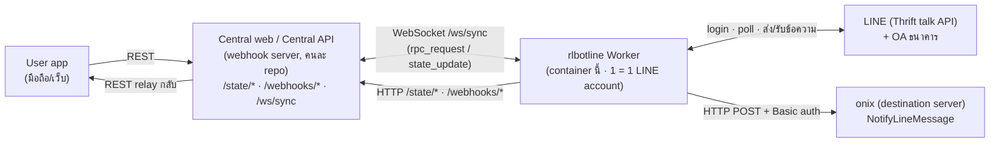
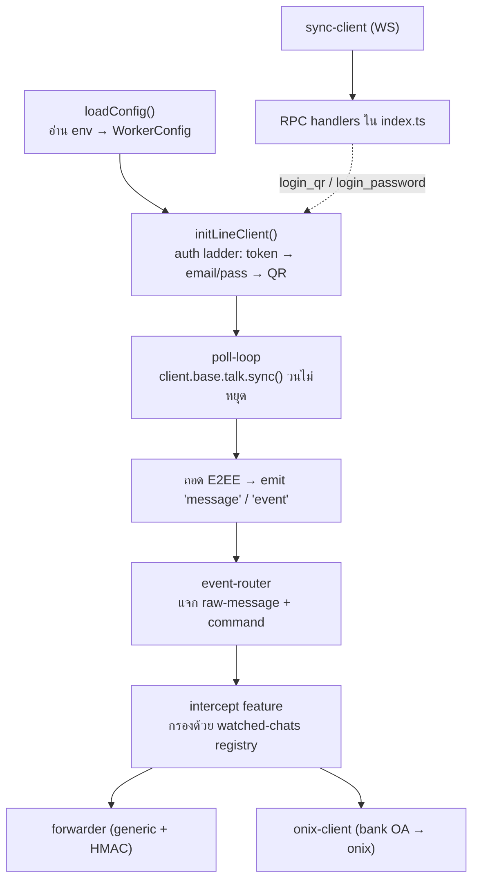

# Architecture — rlbotline Worker

## 1. เป้าหมายของระบบ

ระบบนี้ให้ **LINE user account (selfbot)** ทำ 2 อย่างหลัก:

1. **ติดตาม LINE OA ธนาคาร** (`@scbconnect`, `@krungthaiconnext`, `@kbanklive`) แล้ว **forward
   ข้อความแจ้งเตือน (เช่น เงินเข้า) ไปยัง onix** ("destination server") ผ่าน endpoint `NotifyLineMessage`
2. เปิดให้ **user app ล็อกอิน LINE** ได้ทั้งแบบ **QR** และ **email/password** โดยยิงผ่าน **central web
   (webhook server)** → central web สั่ง bot container ไปคุยกับ LINE → bot รายงานสถานะ (QR/PIN/ready)
   กลับให้ผู้ร้องขอ

Worker นี้เป็นแค่ **หนึ่งชิ้นส่วน** — 1 worker container = 1 LINE account. State ทั้งหมด (session, admin,
watched chats, ฯลฯ) อยู่ที่ **central web / Central API** worker ไม่เก็บ state ลง disk

> โค้ด/รายละเอียดเฉพาะเรื่อง forwarding อยู่ใน [forwarding.md](./forwarding.md) และเรื่อง login อยู่ใน
> [login.md](./login.md)

## 2. Component overview

**หลักการสำคัญ:** worker เป็น **outbound-only** — ไม่มี HTTP server ขาเข้า มันเป็นฝ่าย *dial out* ไปหา
central web เสมอ (ทั้ง REST และ WebSocket) ดังนั้นคำสั่งจาก central web ("ยิงมาสั่ง bot") จึงมาทาง
**WebSocket RPC** บน socket ที่ worker เปิดค้างไว้ ไม่ใช่พอร์ตที่ worker เปิดรอ

## 3. ช่องทางสื่อสารระหว่าง worker กับ central web

| ช่องทาง | ทิศทาง | ใช้ทำอะไร | ไฟล์ |
|---|---|---|---|
| `GET/POST/PUT /state/*` | worker → central | อ่าน/เขียน state (session, watched chats, admin, ...) ด้วย Bearer `INSTANCE_TOKEN` | [../src/core/state-client.ts](../src/core/state-client.ts), [../src/core/database.ts](../src/core/database.ts) |
| `POST /webhooks/worker` | worker → central | รายงานสถานะ: `pincode`, `qrcode`, `ready`, `error`, `status`, `heartbeat`, `shutdown` | [../src/core/webhook.ts](../src/core/webhook.ts) |
| `POST /webhooks/forward` | worker → central | sink กลางสำหรับข้อความจาก watched chats (payload แบบ generic) | [../src/core/forwarder.ts](../src/core/forwarder.ts) |
| `WebSocket /ws/sync` | worker ↔ central | รับ `rpc_request` (central สั่ง worker), `state_update` (invalidate cache); ตอบ `rpc_response` | [../src/core/sync-client.ts](../src/core/sync-client.ts) |

**RPC ที่ central web เรียกได้** (ลงทะเบียนใน [../src/index.ts](../src/index.ts)):
`discover_chats`, `reload_watched_chats`, `list_group_members`, `lookup_contact`, `kick_member`,
`invite_members`, `add_friend`, `list_friends`, `sweep_blacklist`, `backup_group`, `recover_group`,
`list_commands`, `execute_command`, และที่เพิ่มใหม่: **`login_qr`**, **`login_password`**, **`ensure_bank_oa`**

## 4. Runtime model ภายใน worker

- **ไม่ใช้** `client.listen()` (LEGY HTTP/2 push พังบน Bun) — ใช้ **short/long-poll** บน `talk.sync()` แทน
  ([../src/core/poll-loop.ts](../src/core/poll-loop.ts))
- ทุก outbound LINE call ผ่าน **shared rate limiter** (proxy บน `client.base.talk`) เพื่อกันแบน; `sync` ถูกยกเว้น
- E2EE (Letter Sealing) ต้องถอดก่อนอ่านข้อความ — การ login ใหม่จะหมุนกุญแจ E2EE (มี warning ใน log/dashboard)

## 5. Data flow

### 5.1 Bank OA → onix (message forwarding)

ดูรายละเอียดใน [forwarding.md](./forwarding.md) — สรุป: `talk.sync()` → ถอด E2EE → event-router →
`intercept` เช็คว่าเป็น watched chat ที่ enabled → ถ้าเป็น OA และ onix เปิดใช้ → `onix-client.notifyLineMessage()`
POST ไป onix ด้วย Basic auth

### 5.2 On-demand login

ดูรายละเอียดใน [login.md](./login.md) — สรุป: user app → central web → RPC `login_qr`/`login_password` →
worker เริ่ม login กับ LINE → รายงาน `qrcode`/`pincode`/`ready`/`error` ผ่าน `/webhooks/worker` → central web
relay กลับ user app

## 6. Environment variables (สรุป — อ้างอิงจริงที่ [../src/core/config.ts](../src/core/config.ts))

| Var | จำเป็น | ค่าเริ่มต้น | ใช้ทำอะไร |
|---|---|---|---|
| `API_BASE_URL` | ✅ | — | Base URL ของ central web (state/webhooks/sync) |
| `INSTANCE_TOKEN` | ✅ | — | Bearer token ต่อ bot สำหรับ `/state/*` (secret) |
| `INSTANCE_ID` | ✅ | — | id เฉพาะของ bot instance นี้ |
| `LINE_AUTH_TOKEN` | — | — | auth token สำเร็จรูป (ออปชัน; ปกติดึงจาก session) |
| `LINE_EMAIL` / `LINE_PASSWORD` | — | — | login email/password แบบ standalone (ออปชัน) |
| `WEBHOOK_URL` | — | `${API_BASE_URL}/webhooks/forward` | override sink กลางของ forward แบบ generic |
| `ONIX_API_URL` | onix* | — | Base URL ของ onix (ไม่มี `/` ท้าย) |
| `ONIX_ORG` | — | `global` | ค่าใน path `org/{ONIX_ORG}` |
| `ONIX_AGENT_ID` | onix* | — | UUID ของ agent ที่รับ NotifyLineMessage |
| `ONIX_API_USER` | — | `api` | Basic auth user |
| `ONIX_API_KEY` | onix* | — | Basic auth password / API key (secret) |
| `ONIX_APPLICATION_TYPE` | — | `backend` | ค่า header `Onix-Application-Type` |
| `ONIX_FORWARD_TIMEOUT_MS` | — | `5000` | timeout ของ POST ไป onix (ms) |
| `BANK_OA_HANDLES` | — | `@scbconnect,@krungthaiconnext,@kbanklive` | รายการ OA ที่ follow + watch |
| `WATCH_HMAC_SECRET` | — | — | secret เซ็น forward แบบ generic (ออปชัน) |
| `WATCH_FORWARD_TIMEOUT_MS` | — | `5000` | timeout ของ forward แบบ generic |
| `PIN_WAIT_TIMEOUT_MS` | — | `300000` | รอ PIN นานสุดก่อน park worker |
| `COMMAND_PREFIX` | — | `!` | prefix คำสั่งบอท |
| `LINE_DEVICE` | — | `IOSIPAD` | device type ของ linejs |
| `RATE_LIMIT_CALLS` / `RATE_LIMIT_WINDOW_MS` | — | `5` / `10000` | rate limiter (anti-ban) |
| `MESSAGE_RETENTION_HOURS` | — | `24` | เก็บ cache ข้อความกี่ชั่วโมง |
| `LOG_LEVEL` | — | `info` | ระดับ log |

\* **onix*** = ต้องมีครบ 3 ตัว (`ONIX_API_URL` + `ONIX_AGENT_ID` + `ONIX_API_KEY`) ถึงจะเปิด forwarding ไป onix

> หมายเหตุความไม่ตรงที่พบ (ยังไม่แก้ในรอบนี้): `PROXY_URL` มีในเอกสาร/`.env.example` แต่ยังไม่ถูกอ่านใน
> `src/`; `API_BASE_URL` ตัวอย่างเป็น `:3001` แต่ fallback ใน `sync-client.ts`/entrypoint เป็น `:3000`;
> npm scripts `db:*`/`docker:*` ใน `package.json` อ้างไฟล์/`packages/api` ที่ไม่มีใน repo worker-only นี้

## 7. Deployment (สรุป — รายละเอียดใน [../README.md](../README.md))

- Local: `bun install` → `bun run dev` / `bun run start`
- Docker: `docker compose up --build -d` (ไม่ map port — outbound-only)
- Deploy script: `scripts/deploy-worker.sh build|run|deploy` (ต้องส่ง env onix เข้า container ด้วย)
