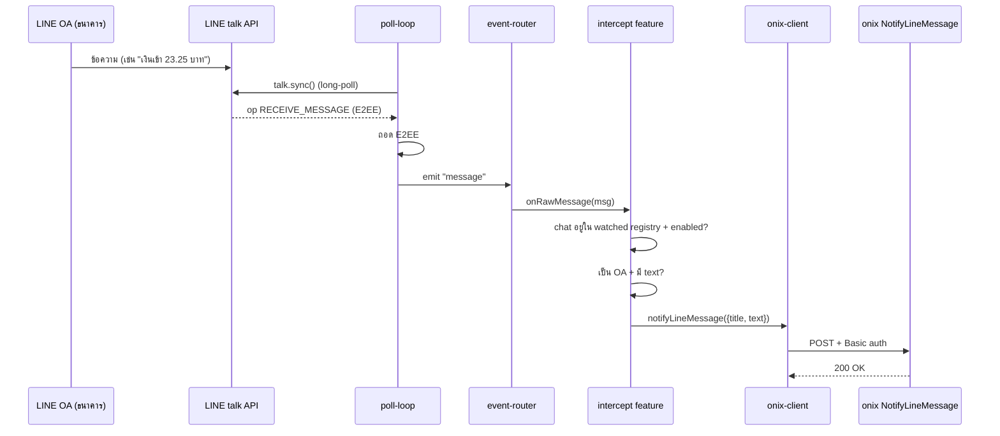
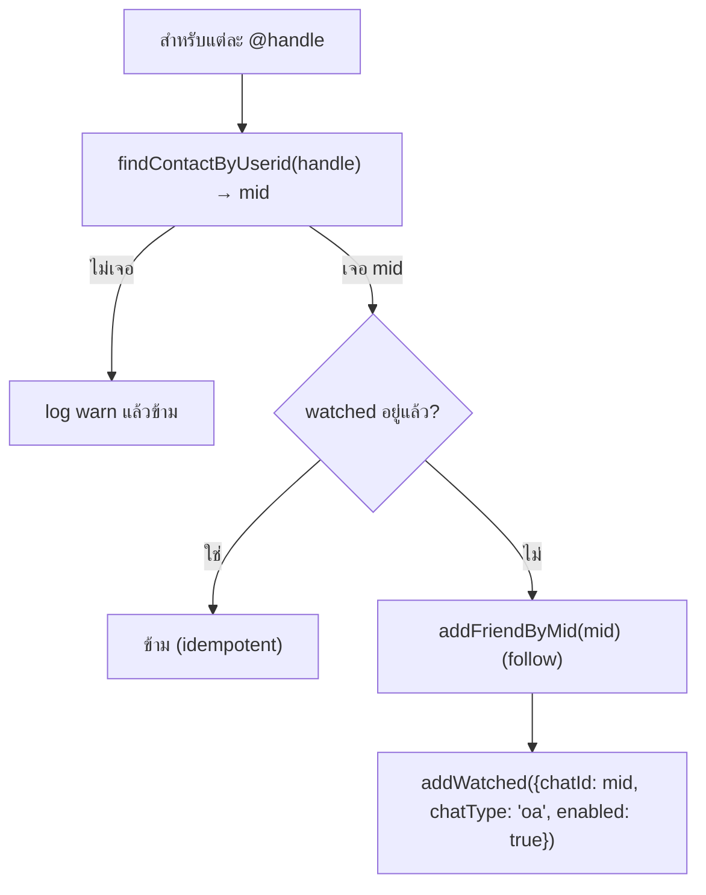
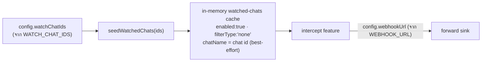

# Forwarding — Bank OA → onix

เอกสารนี้อธิบายเส้นทางที่ข้อความจาก **LINE OA ธนาคาร** ถูกส่งต่อไปยัง **onix** (destination server) และ
เส้นทาง forward แบบทั่วไป (generic) ที่ทำงานได้แม้ไม่มี Central API — ดู §3b

> **Central API เป็นออปชัน** ([architecture.md](./architecture.md) §1) ทั้ง bank-OA→onix (§3-4) และ
> generic forward (§3b) ทำงานได้ **100% แบบ standalone** ไม่ต้องพึ่ง `API_BASE_URL` เลย — สิ่งที่ต้องมี Central
> API คือ per-chat `forwardUrl`/webhook targets แบบ dynamic ที่ตั้งผ่านคำสั่งแชท/dashboard เท่านั้น

## 1. ภาพรวม pipeline



ไฟล์ที่เกี่ยวข้อง:
- [../src/core/poll-loop.ts](../src/core/poll-loop.ts) — รับ + ถอด E2EE
- [../src/features/intercept.ts](../src/features/intercept.ts) — กรอง watched chats + เรียก onix
- [../src/core/chat-registry.ts](../src/core/chat-registry.ts) — registry ของ watched chats
- [../src/core/onix-client.ts](../src/core/onix-client.ts) — adapter → onix NotifyLineMessage
- [../src/core/forwarder.ts](../src/core/forwarder.ts) — forward แบบ generic (แยกจาก onix)

## 2. การเลือกว่าจะ forward อันไหน

`intercept` จะ forward เฉพาะข้อความที่:

1. มาจาก chat ที่อยู่ใน **watched-chats registry** และ `enabled = true`
2. **ไม่ใช่คำสั่งบอท** (ขึ้นต้นด้วย `COMMAND_PREFIX`)
3. ผ่าน **filter** ของ chat นั้น (`none` / `substring` / `regex`) ถ้ามีตั้งไว้

เฉพาะเส้นทาง **onix** เพิ่มเงื่อนไข:

4. `onix.enabled === true` (ตั้ง env ครบ)
5. `watched.chatType === "oa"` (เป็น official account)
6. ข้อความมี **text** ไม่ว่าง — onix's NotifyLineMessage สื่อสารด้วย `title` + `text`; ข้อความที่เป็น
   media/sticker ล้วน (ไม่มี text) จะถูก **ข้าม** พร้อม log ระดับ `debug` (ไม่ทิ้งเงียบ)

> การ forward แบบ generic (per-chat `forwardUrl`, user webhook targets, และ sink กลาง
> `/webhooks/forward`) ยังทำงานเหมือนเดิมทุกข้อความที่ผ่านข้อ 1–3 — onix เป็น sink **เพิ่มเติม** ไม่ทับของเดิม

## 3. การติดตาม OA ธนาคาร 3 ตัว

`BANK_OA_HANDLES` (default `@scbconnect,@krungthaiconnext,@kbanklive`) กำหนดว่าจะ follow + watch OA ตัวไหน

ตอน boot worker จะรัน `ensureBankOaWatched()` ([../src/index.ts](../src/index.ts)) — **idempotent**:



- รันผ่าน **shared rate limiter** (talk proxy) — ปลอดภัยที่จะรันทุก boot
- เรียกซ้ำได้ผ่าน RPC **`ensure_bank_oa`** จาก central web
- ถ้าอยากคุมเอง (ไม่ auto) ตั้ง `BANK_OA_HANDLES=` (ว่าง) แล้วเพิ่มด้วยคำสั่ง `!watch add <mid>` แทน
- `ensureBankOaWatched()` เรียก `addWatched()` ([../src/core/chat-registry.ts](../src/core/chat-registry.ts))
  ซึ่งมี standalone branch (เขียน in-memory cache ตรง ไม่ผ่าน `/state/watched-chats`) ดังนั้น bank-OA → onix
  ทำงานได้ครบแม้ไม่มี Central API เลย — ไม่ต้องพึ่ง §3b ด้านล่าง

## 3b. Standalone watch — `WATCH_CHAT_IDS` (ไม่มี Central API)

เมื่อ `API_BASE_URL` ไม่ได้ตั้ง (`centralApiEnabled = false`) worker จะ **ไม่** query `/state/watched-chats`
ตอน boot — แทนที่ด้วยการ seed **watched-chats cache ในหน่วยความจำ** ตรงจาก env `WATCH_CHAT_IDS`
(comma-separated chat id เช่น `c1234...,c5678...`) ผ่าน `seedWatchedChats()`
([../src/core/chat-registry.ts](../src/core/chat-registry.ts)) ที่ step 6b ของ boot
([../src/index.ts](../src/index.ts)):



รายละเอียด:
- แต่ละ id ที่ seed จะได้ `enabled: true`, `filterType: 'none'` (forward ทุกข้อความ), ไม่มี `forwardUrl`
  ต่อ-chat, `chatType` derive จาก prefix ของ mid (`c`=group, `r`=room, `s`/`m`=square, `u`=user), และ
  `chatName` = ตัว chat id เอง (ไม่มีการ resolve ชื่อจริงจาก LINE — best-effort)
- เส้นทาง forward ที่เหลือเหมือนเดิมทุกอย่าง — `intercept` เช็ค watched registry + filter (§2 ข้างบน) แล้ว
  `fanOut()` ไปยัง targets; ในโหมด standalone targets มีแค่ `config.webhookUrl` (มาจาก `WEBHOOK_URL` เท่านั้น
  — ไม่มี default `${API_BASE_URL}/webhooks/forward` เพราะไม่มี `API_BASE_URL`) เพราะ
  `getWebhookTargets()` (`/state/settings`) คืน `[]` เสมอเมื่อ `isCentralApiEnabled()` เป็น false
  ([../src/core/database.ts](../src/core/database.ts))
- **ต้องตั้ง `WEBHOOK_URL` เอง** ในโหมด standalone มิฉะนั้น `config.webhookUrl` จะเป็น `undefined` และ
  `intercept` จะไม่มีปลายทางให้ forward เลย (ยังคง forward ไป per-chat `forwardUrl` ถ้ามีการตั้งไว้ตรงๆ ผ่าน
  `addWatched`, แต่ `seedWatchedChats` ไม่ตั้งค่านี้ให้)
- ใช้เสริมกับ bank-OA→onix ได้ — `WATCH_CHAT_IDS` คือทางสำหรับ **กลุ่ม/แชทอื่นที่ไม่ใช่ bank OA** ที่อยาก forward
  ไป `WEBHOOK_URL` โดยไม่ต้องพึ่ง Central API หรือคำสั่งแชท `!watch add`

## 4. onix contract (NotifyLineMessage)

อ้างอิงจากตัวอย่าง `examples/Admin/test-admin-agent-notify.rb` + `utils.rb` ของ onix

### Request

```
POST {ONIX_API_URL}/admin-api/AdminAgent/org/{ONIX_ORG}/action/NotifyLineMessage/{ONIX_AGENT_ID}

Content-Type:          application/json
Onix-Application-Type: backend
Authorization:         Basic base64("api:apikey")
```

### Body

```json
{
  "sourceType":  "NOTIFICATION",
  "sourceKey":   "jp.naver.line.android",
  "sourceLabel": "LINE",
  "title":       "Krungthai Connext",
  "text":        "เงินเข้า: 23.25 บาท เข้าบัญชี XX7157 เมื่อ 16/06/6"
}
```

### Mapping

| onix field | ที่มา | หมายเหตุ |
|---|---|---|
| `sourceType` | คงที่ `"NOTIFICATION"` | |
| `sourceKey` | คงที่ `"jp.naver.line.android"` | |
| `sourceLabel` | คงที่ `"LINE"` | |
| `title` | `watched.chatName` | ชื่อ OA เช่น "Krungthai Connext" |
| `text` | `msg.text` | ข้อความจริงจาก OA |

### Authentication

Basic auth: **user = `ONIX_API_USER` (default `api`)**, **password = `ONIX_API_KEY`** →
header `Authorization: Basic base64("api:apikey")` (สร้างใน `onix-client.ts` `buildBasicAuth`)

> รูปแบบ Basic auth `api:<key>` นี้ตรงกับที่ generic forwarder ทำอยู่แล้ว
> (`forwarder.ts` `buildApiKeyAuthorization`) — onix-client แค่เพิ่ม header `Onix-Application-Type`
> และ endpoint ที่มี `agentId` เข้าไป

## 5. Error handling

- `onix-client.notifyLineMessage()` **ไม่ throw** — คืน `{ ok, status?, error?, skipped? }`
- Timeout ต่อ request = `ONIX_FORWARD_TIMEOUT_MS` (default 5000ms) ผ่าน `AbortController`
- non-2xx หรือ network error → log `warn` + คืน `ok:false` (ไม่ล้ม pipeline)
- onix ไม่ได้ตั้งค่า → คืน `{ skipped: true }` (intercept ไม่ log เป็น error)

## 6. การตั้งค่า (env)

```dotenv
ONIX_API_URL=https://api.onix.example.com
ONIX_ORG=global
ONIX_AGENT_ID=198b743a-4579-41ee-853f-a748f6a40825
ONIX_API_USER=api
ONIX_API_KEY=apikey
ONIX_APPLICATION_TYPE=backend
ONIX_FORWARD_TIMEOUT_MS=5000
BANK_OA_HANDLES=@scbconnect,@krungthaiconnext,@kbanklive
```

onix forwarding **ปิดอัตโนมัติ** ถ้าไม่ได้ตั้ง `ONIX_API_URL` + `ONIX_AGENT_ID` + `ONIX_API_KEY` ครบ

### Generic forward (standalone — §3b)

```dotenv
# Chat ids to watch + forward, no Central API needed:
WATCH_CHAT_IDS=c1234567890abcdef1234567890abcd,c98765...
# Forward sink — required in standalone mode (no API_BASE_URL default):
WEBHOOK_URL=https://your-webhook.example.com/ingest
# Optional: sign forwards with HMAC-SHA256 (Standard Webhooks headers)
WATCH_HMAC_SECRET=
WATCH_FORWARD_TIMEOUT_MS=5000
```
