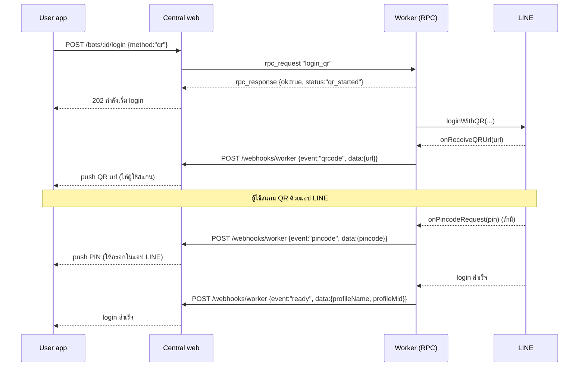
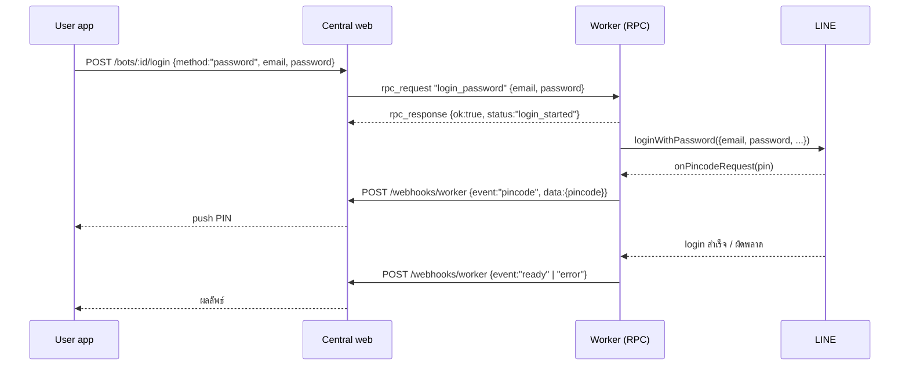

# Login — On-demand QR / email-password

เอกสารนี้อธิบายวิธีสั่งให้ bot ล็อกอิน LINE (QR หรือ email/password) แล้วอ่านสถานะกลับ

มี **2 ช่องทาง** ที่รองรับพร้อมกัน:

- **HTTP API (แนะนำสำหรับ standalone app)** — container เปิด HTTP server บน `HTTP_PORT` (default 3000)
  ให้ยิง `POST /login/qr` หรือ `POST /login/password` มาที่ bot ตรงๆ แล้ว poll `GET /login/status` — ดูข้อ 2
- **WebSocket RPC (ผ่าน central web)** — central web เรียก RPC `login_qr`/`login_password` ผ่าน `/ws/sync`
  แล้ว bot รายงานผ่าน webhook events — ดูข้อ 5–6

ทั้งสองช่องใช้ login state เดียวกัน ([../src/core/login-state.ts](../src/core/login-state.ts)) และ flow login
ตัวเดียวกัน ([../src/core/line-client.ts](../src/core/line-client.ts) `startQrLogin`/`startPasswordLogin`)

## 1. Boot behavior (standalone)

ก่อนเข้า auth ladder worker จะ `configureRedis()` แล้ว `loadSessionFromRedis()` โหลด auth token +
storage blob ที่ persist ไว้จาก run ก่อนหน้า (ถ้ามี `REDIS_HOST`) — ดูรายละเอียดเต็มใน §9

จากนั้นตอน boot `initLineClient()` ลอง login ตามลำดับ token (Redis ก่อน, ตกไป `LINE_AUTH_TOKEN`) →
email/password (env เท่านั้น) → QR **ยกเว้น** กรณีไม่มี token และไม่มี credential **และ** เปิด HTTP API ไว้
(`HTTP_PORT>0`) — worker จะ **ไม่** auto-QR แต่รอให้ app ยิง `POST /login/*` เข้ามาแทน (`initLineClient` คืน
`onboarding-required`, bootstrap รอ `waitForLoginReady()` แล้วค่อยขึ้นระบบต่อเมื่อ login สำเร็จ) → app เป็นคน
เลือกวิธี login เอง

## 2. HTTP API (บน HTTP_PORT, default 3000)

| Method + Path | Auth | Body | ผลลัพธ์ |
|---|---|---|---|
| `GET /health` | ไม่ต้อง | — | `{ ok, instanceId, uptimeSec, login: <state>, connection, lastSyncAgoSec }` — **503** เมื่อ `ok:false` |
| `GET /status` | Basic | — | ภาพรวมเต็ม: `login` (มี `loggedIn`, `expired`), `connection`, build, ปลายทาง, watched |
| `GET /login/status` | Basic | — | `{ ok, state, loggedIn, connection, lastSyncAgoSec, qrUrl?, pincode?, profileName?, profileMid?, error?, updatedAt }` |
| `POST /login/qr` | Basic | — | เริ่ม QR login (พื้นหลัง), รอ QR URL สูงสุด ~12s → `202 { ok, state, qrUrl? }` |
| `POST /login/password` | Basic | `{ email, password }` | เริ่ม email/password login → `202 { ok, state }` |

- **Auth**: `/login/*` ใช้ HTTP Basic auth `HTTP_API_USER:HTTP_API_KEY` (default user `api`) เมื่อตั้ง
  `HTTP_API_KEY`; ถ้าไม่ตั้งจะเปิดโล่ง (log warning) ส่วน `GET /health` เปิดเสมอ
- **flow ทั่วไป**: `POST /login/qr` → เอา `qrUrl` ไปแสดงให้ผู้ใช้สแกน → poll `GET /login/status` จนเจอ
  `pincode` (กรอกในแอป LINE) → จน `state:"ready"`
- login state: `idle → starting → qr_pending / pin_pending → ready` (หรือ `error`)
- **`state:"ready"` อย่างเดียวเชื่อไม่ได้ว่ายังออนไลน์** — มันบอกแค่ว่า login ครั้งล่าสุดสำเร็จ ถ้า LINE
  เพิกถอน session ทีหลัง poll loop จะปลดเป็น `state:"expired"` และ `connection:"expired"` (ดู
  [architecture.md](./architecture.md) §3 ตาราง `connection`) ให้ใช้ `loggedIn` ซึ่งเป็น
  `state === "ready" && session healthy` เป็นตัวตัดสินว่าต้องขึ้น QR ให้ผู้ใช้สแกนใหม่หรือยัง
- ถ้า LINE กลับมาตอบเองโดยไม่ต้อง login ใหม่ `expired` จะเลื่อนกลับเป็น `ready` อัตโนมัติ
- **login ใหม่ตอน worker รันอยู่** (ยิง `POST /login/qr` หลัง session หลุด) จะสร้าง `Client` ตัวใหม่ทั้งอัน
  worker จึงย้ายทุกอย่างที่ผูกกับตัวเก่ามาให้เอง: event router (`client.on(...)` ผูกกับ *object*)
  และ poll loop — loop เก่าจะออกทันทีที่ตัวใหม่รับช่วง ไม่งั้นมันจะ poll ด้วย token ที่ถูกเพิกถอน
  แล้วเขียน `expired` ทับ login ที่เพิ่งสำเร็จ (อาการ "สแกน QR ใหม่แล้วแต่ status ค้างเป็น expired")

ตัวอย่าง:
```bash
curl -u api:$HTTP_API_KEY -X POST http://bot:3000/login/qr
curl -u api:$HTTP_API_KEY http://bot:3000/login/status
curl -u api:$HTTP_API_KEY http://bot:3000/status   # login + connection health ครบชุด
curl -fsS http://bot:3000/health                   # exit != 0 เมื่อ session ตาย/ค้าง
curl -u api:$HTTP_API_KEY -X POST http://bot:3000/login/password \
  -H 'Content-Type: application/json' -d '{"email":"a@b.com","password":"secret"}'
```

## 3. หลักการ (WS-RPC ผ่าน central web — ทางเลือก)

อีกทางเลือกหนึ่ง: user app ยิงไปที่ **central web** แล้ว central web "ยิงมาสั่ง" worker ผ่าน **WebSocket
RPC** (`/ws/sync`) จากนั้น worker ไปคุยกับ LINE เอา QR/ทำ login แล้วรายงานสถานะ (`qrcode` / `pincode` /
`ready` / `error`) กลับผ่าน `/webhooks/worker` → central web relay ต่อให้ user app

## 4. Sequence — QR login (WS-RPC)



## 5. Sequence — email/password login (WS-RPC)



## 6. RPC ที่ worker รับ (central web เรียก)

ลงทะเบียนใน [../src/index.ts](../src/index.ts) บน WebSocket sync hub:

| RPC | args | คืนค่า (ทันที) | ทำอะไร |
|---|---|---|---|
| `login_qr` | — | `{ok:true, status:"qr_started"}` | เริ่ม QR login (background); QR/PIN/สถานะไปทาง webhook |
| `login_password` | `{email, password}` | `{ok:true, status:"login_started"}` | เริ่ม email/password login (background) |
| `ensure_bank_oa` | — | `{ok:true, handles:<n>}` | follow + watch OA ธนาคารตาม `BANK_OA_HANDLES` |

RPC จะ **คืนค่าทันที** (ไม่ block รอสแกน) — login รันเบื้องหลัง แล้ว stream สถานะผ่าน webhook events
มี **guard กันชนกัน**: ถ้ามี login ค้างอยู่ การเรียกซ้ำจะได้ผลลัพธ์ `login-failed` (`"login already in progress"`)

โค้ดฝั่ง login อยู่ใน [../src/core/line-client.ts](../src/core/line-client.ts):
`startQrLogin(config)` / `startPasswordLogin(config, email, password)` — reuse auth flow เดิม
(retry/backoff + PIN-timeout-park semantics เหมือน bootstrap)

## 7. Webhook events ที่ worker ส่งกลับ (central web subscribe)

POST ไป `${API_BASE_URL}/webhooks/worker` header `X-Instance-ID: <instanceId>`
body: `{ instanceId, event, data, timestamp }` ([../src/core/webhook.ts](../src/core/webhook.ts))

| event | data | ความหมาย |
|---|---|---|
| `qrcode` | `{ url }` | มี QR ให้สแกน — central web แปลงเป็น QR ให้ user app |
| `pincode` | `{ pincode }` | ต้องกรอก PIN 2FA ในแอป LINE |
| `ready` | `{ profileName, profileMid }` | login สำเร็จ พร้อมใช้งาน |
| `error` | `{ message, ... }` | login/รันผิดพลาด |
| `status` | `{ status, message?, reason? }` | สถานะทั่วไป (เช่น `stopped` เมื่อ PIN timeout, `running` เมื่อ E2EE key หมุน) |
| `heartbeat` | `{ uptime, memoryMB }` | ทุก 60 วินาที (health) |
| `shutdown` | `{ reason }` | worker กำลังปิด |

## 8. Auth ladder ตอน boot (เพื่อความเข้าใจ)

นอกจาก on-demand login แล้ว ตอน boot `initLineClient()` ยังลอง login อัตโนมัติตามลำดับ:

1. **Auth token** — token ที่ persist ไว้ใน **Redis** (`{REDIS_KEY_PREFIX}:auth-token`) ชนะก่อนเสมอ ถ้าไม่มี
   (ไม่ได้ตั้ง `REDIS_HOST`, หรือยังไม่เคย login มาก่อน) จะ fallback ไปที่ env `LINE_AUTH_TOKEN`
2. **Email/password** — จาก env `LINE_EMAIL`/`LINE_PASSWORD` **เท่านั้น** — ไม่มี credential source จาก
   Central API/session อีกต่อไป (ตัด `/state/session/*` ออกทั้งหมด)
3. **QR** — เมื่อไม่มี token และไม่มี email/password **และ** ปิด HTTP API (`HTTP_PORT=0`)

> เมื่อเปิด HTTP API ไว้ (default `HTTP_PORT=3000`) กรณีข้อ 3 จะ **ไม่** auto-QR แต่รอ `POST /login/*`
> แทน (ดูข้อ 1 "Boot behavior")

ถ้าเปิด HTTP API: bootstrap รอ `waitForLoginReady()` จนกว่าจะ login สำเร็จ (ผ่าน HTTP หรือ WS-RPC) แล้วค่อย
ขึ้นระบบ ถ้าปิด HTTP API และ login ไม่เสร็จภายใน `PIN_WAIT_TIMEOUT_MS` (default 5 นาที) worker จะ **park**
ตัวเอง (idle รอ restart)

> **หมายเหตุ E2EE:** การ login ใหม่ (ไม่ใช่ token restore) จะหมุนกุญแจ Letter Sealing (E2EE) ข้อความที่
> เข้ารหัสด้วยกุญแจเก่าจะถอดไม่ได้อีก — worker log/รายงาน warning เมื่อเกิดเหตุนี้

## 9. Credentials & ความปลอดภัย

- email/password ที่ส่งผ่าน RPC `login_password` **ไม่ถูก log เป็น plaintext** (log เฉพาะ PIN ตามดีไซน์เดิม
  เพื่อให้ผู้ปฏิบัติงานเห็นจาก log ได้)
- **session persistence เปลี่ยนไปจากเดิมทั้งหมด:** session (auth token + linejs storage blob พร้อม E2EE
  keys) persist ไปที่ **Redis เท่านั้น** — `{REDIS_KEY_PREFIX}:auth-token` (ตั้งทันทีที่ login/refresh ผ่าน
  event `update:authtoken`) และ `{REDIS_KEY_PREFIX}:storage` (debounce 1s, flush ทันทีตอน graceful shutdown
  ผ่าน `flushSession()`) — **ไม่ใช่ Central API อีกต่อไป**; `PUT /state/session/*` ถูกลบออกจากโค้ดแล้ว
  ([../src/core/redis-client.ts](../src/core/redis-client.ts), [../src/core/line-client.ts](../src/core/line-client.ts))
  - ไม่มี Redis auth — ต่อด้วย `REDIS_HOST`/`REDIS_PORT` เฉยๆ (`redis://host:port`)
  - ถ้า **ไม่ตั้ง** `REDIS_HOST`: session อยู่ใน **หน่วยความจำเท่านั้น** สำหรับ run นั้น (มี warning log ดังๆ ตอน
    boot) — restart ทุกครั้งต้อง login ใหม่ ซึ่งจะหมุนกุญแจ Letter Sealing (E2EE) ใหม่ทุกครั้ง (ข้อความเก่าถอด
    ไม่ได้) และ login ซ้ำถี่ๆ จาก IP เดิมมีความเสี่ยงโดนแบนบัญชี — **`REDIS_HOST` คือกลไก anti-ban หลักของ
    session persistence**
  - container ที่ใช้ LINE account เดียวกัน (เช่น restart/redeploy) **ต้องตั้ง `REDIS_KEY_PREFIX` ให้ตรงกัน**
    เพื่อ restore session เดิมแทนที่จะ login ใหม่ทุกครั้ง (default: `rlbotline:${INSTANCE_ID}`)
  - credentials (`LINE_EMAIL`/`LINE_PASSWORD`) มาจาก env เท่านั้น — Redis เก็บแค่ auth token/storage blob
    ไม่เก็บ credential ดิบ
- 1 worker = 1 LINE account — อย่ารันหลายบัญชีหลัง IP เดียว (anti-ban) ให้ตั้ง `PROXY_URL` แยกต่อ instance
