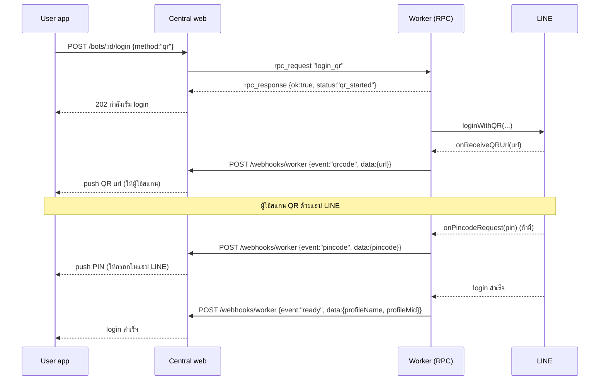
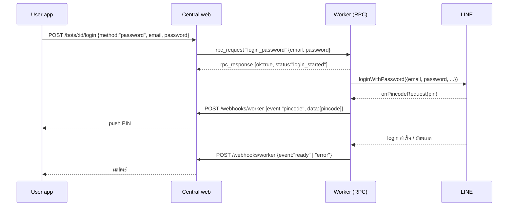

# Login — On-demand QR / email-password ผ่าน central web

เอกสารนี้อธิบายวิธีที่ **user app สั่งให้ bot ล็อกอิน LINE** (QR หรือ email/password) โดยผ่าน **central web
(webhook server)** แล้ว bot รายงานสถานะกลับ

## 1. หลักการ

worker เป็น **outbound-only** — user app **ไม่** ยิงตรงมาที่ worker แต่ยิงไปที่ **central web** แล้ว central
web เป็นคน "ยิงมาสั่ง" worker ผ่าน **WebSocket RPC** (`/ws/sync`) จากนั้น worker ไปคุยกับ LINE เอา QR/ทำ
login แล้วรายงานสถานะ (`qrcode` / `pincode` / `ready` / `error`) กลับผ่าน `/webhooks/worker` → central web
relay ต่อให้ user app

## 2. Sequence — QR login

## 3. Sequence — email/password login

## 4. RPC ที่ worker รับ (central web เรียก)

ลงทะเบียนใน [../src/index.ts](../src/index.ts) บน WebSocket sync hub:

| RPC | args | คืนค่า (ทันที) | ทำอะไร |
|---|---|---|---|
| `login_qr` | — | `{ok:true, status:"qr_started"}` | เริ่ม QR login (background); QR/PIN/สถานะไปทาง webhook |
| `login_password` | `{email, password}` | `{ok:true, status:"login_started"}` | เริ่ม email/password login (background) |
| `ensure_bank_oa` | — | `{ok:true, handles:<n>}` | follow + watch OA ธนาคารตาม `BANK_OA_HANDLES` |

RPC จะ **คืนค่าทันที** (ไม่ block รอสแกน) — login รันเบื้องหลัง แล้ว stream สถานะผ่าน webhook events
มี **guard กันชนกัน**: ถ้ามี login ค้างอยู่ การเรียกซ้ำจะได้ผลลัพธ์ `login-failed` (`"login already in progress"`)

โค้ดฝั่ง login อยู่ใน [../src/core/line-client.ts](../src/core/line-client.ts):
`startQrLogin(config)` / `startPasswordLogin(config, email, password)` — reuse auth flow เดิม
(retry/backoff + PIN-timeout-park semantics เหมือน bootstrap)

## 5. Webhook events ที่ worker ส่งกลับ (central web subscribe)

POST ไป `${API_BASE_URL}/webhooks/worker` header `X-Instance-ID: <instanceId>`
body: `{ instanceId, event, data, timestamp }` ([../src/core/webhook.ts](../src/core/webhook.ts))

| event | data | ความหมาย |
|---|---|---|
| `qrcode` | `{ url }` | มี QR ให้สแกน — central web แปลงเป็น QR ให้ user app |
| `pincode` | `{ pincode }` | ต้องกรอก PIN 2FA ในแอป LINE |
| `ready` | `{ profileName, profileMid }` | login สำเร็จ พร้อมใช้งาน |
| `error` | `{ message, ... }` | login/รันผิดพลาด |
| `status` | `{ status, message?, reason? }` | สถานะทั่วไป (เช่น `stopped` เมื่อ PIN timeout, `running` เมื่อ E2EE key หมุน) |
| `heartbeat` | `{ uptime, memoryMB }` | ทุก 60 วินาที (health) |
| `shutdown` | `{ reason }` | worker กำลังปิด |

## 6. Auth ladder ตอน boot (เพื่อความเข้าใจ)

นอกจาก on-demand login แล้ว ตอน boot `initLineClient()` ยังลอง login อัตโนมัติตามลำดับ:

1. **Auth token** — `LINE_AUTH_TOKEN` หรือ token ที่ persist ไว้ใน session ของ central web
2. **Email/password** — จาก session หรือ env `LINE_EMAIL`/`LINE_PASSWORD` (session ชนะ)
3. **QR** — เมื่อไม่มี token และไม่มี email/password

ถ้า login ไม่เสร็จภายใน `PIN_WAIT_TIMEOUT_MS` (default 5 นาที) worker จะ **park** ตัวเอง (idle รอ restart หรือ
รอ RPC `login_qr`/`login_password` มาเริ่มใหม่)

> **หมายเหตุ E2EE:** การ login ใหม่ (ไม่ใช่ token restore) จะหมุนกุญแจ Letter Sealing (E2EE) ข้อความที่
> เข้ารหัสด้วยกุญแจเก่าจะถอดไม่ได้อีก — worker log/รายงาน warning เมื่อเกิดเหตุนี้

## 7. Credentials & ความปลอดภัย

- email/password ที่ส่งผ่าน RPC `login_password` **ไม่ถูก log เป็น plaintext** (log เฉพาะ PIN ตามดีไซน์เดิม
  เพื่อให้ผู้ปฏิบัติงานเห็นจาก log ได้)
- session (auth token + E2EE keys) ถูก mirror ไปเก็บที่ central web (`PUT /state/session/*`) ไม่เก็บลง disk
- 1 worker = 1 LINE account — อย่ารันหลายบัญชีหลัง IP เดียว (anti-ban) ให้ตั้ง `PROXY_URL` แยกต่อ instance
